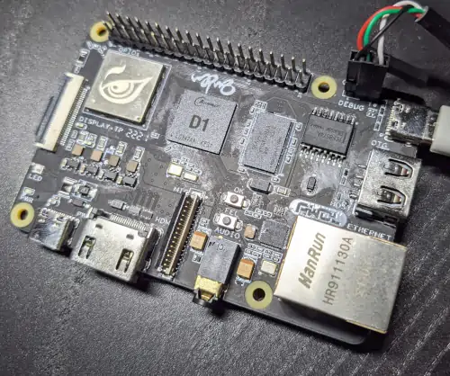

# Allwinner D1 Nezha Board Development Environment



This repository gives you access to an easy to setup chroot
environment that allows compilation of and experimentation with the
system software of the Linux-capable 64-bit RISC-V
[Nezha](https://liliputing.com/2021/05/nezha-is-a-99-single-board-pc-with-a-risc-v-processor.html)
board:

- [OpenSBI](https://github.com/riscv/opensbi),
- [U-Boot](https://www.denx.de/wiki/U-Boot), and
- [Linux](https://www.kernel.org/)

with out the hassle of setting up a RISC-V cross-compilation
environment and keeping it working.

## Relevant Documentation

The
[linux-sunxi](https://linux-sunxi.org/Allwinner_Nezha#Manual_build)
wiki contains detailed instruction on how to find and build OpenSBI,
U-Boot, and Linux for the Nezha board. This description largely
applies.

**Note:** You have to use `CROSS_COMPILE=riscv64-unknown-linux-gnu-`
instead of `CROSS_COMPILE=riscv64-linux-gnu-`. But the chroot already
comes with this automatically set in the environment.

## Usage

To use the chroot in this repository, you need to [install
Nix](https://nixos.org/download.html).

Then you can enter the [Nix
shell](https://ghedam.at/15978/an-introduction-to-nix-shell).

```sh
$ nix-shell
```

You can streamline entering the Nix shell by using
[direnv](https://direnv.net/), which makes this automatic when you
`cd` into the directory.

If you enter this shell the first time, it will be slow, because the
cross-compilation toolchain is built. Going forward, this toolchain is
cached. My [Cachix](https://www.cachix.org/) repo may contain prebuilt
copies built in this repo via Github Actions. You can do `cachix use
blitz` to use it.

After entering the Nix shell, you have access to three tools:

- `fhs`, which drops you into the Nezha development chroot,
- `connect-nezha`, which connects to the serial port of the Nezha
  board (if you [connected a USB serial
  adapter](https://linux-sunxi.org/Allwinner_Nezha#Adding_a_serial_port)
  to the debug pins),
- [niv](https://github.com/nmattia/niv), which is used to update this
  environment.

After you enter the chroot, you can compile system software for the
Nezha board following the linux-sunxi wiki:

```sh

nix-shell $ fhs

fhs-chrootenv $ cd work
fhs-chrootenv work $ git clone https://github.com/smaeul/opensbi -b d1-wip
...

# The environment variable is already set for you convenience.
fhs-chrootenv work $ echo CROSS_COMPILE
riscv64-unknown-linux-gnu-

fhs-chrootenv work $ PLATFORM=generic FW_PIC=y make -C opensbi
...
 AS        platform/generic/firmware/fw_payload.o
 ELF       platform/generic/firmware/fw_payload.elf
 OBJCOPY   platform/generic/firmware/fw_payload.bin
```

🚀🚀🚀 That's it. Happy cross compiling! 🚀🚀🚀
